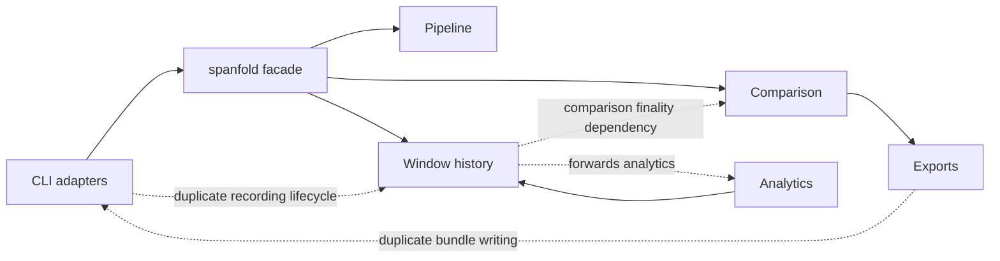

# Rust Architecture Review Catalog

> **Historical review snapshot.** Findings below describe revision `7f39c18`
> and must not be read as the current status of `main`. The catalog is retained
> as review evidence rather than rewritten after each remediation.

**Review date:** 2026-07-12  
**Reviewed revision:** `7f39c18` (`main`)  
**Scope:** `packages/rust`, the Rust CLI, and `examples/npc_stress_test/rust`  
**Disposition:** Four genuine god-file risks remain. The main deficit is module locality and canonical state, not broad underuse of Rust traits.

The visual companion report is [RUST_ARCHITECTURE_REVIEW.html](RUST_ARCHITECTURE_REVIEW.html).

## Executive verdict

The Rust implementation already makes several sound design choices:

- Closed behavioral sets use enums, particularly `Comparator`.
- Caller-supplied selectors and callbacks use Rust's `Fn` traits through `Arc<dyn Fn>`.
- `ImportedWindowSink` is a justified trait with two real adapters.
- `TemporalPoint`, `TemporalRange`, `PrimitiveValue`, and `WindowRecordId` provide useful typed domain values.
- `lib.rs` can preserve compatibility while implementations are decomposed behind it.

The remaining architecture problems are concentrated in four files:

| File | Production lines | Verdict |
| --- | ---: | --- |
| `crates/spanfold/src/comparison.rs` | 2,725 | Genuine god file inside a cohesive comparison module |
| `crates/spanfold/src/records.rs` | 1,900 | Genuine god file with incorrect dependency direction |
| `crates/spanfold/src/pipeline.rs` | 1,651 | Deep external module with a god-file implementation |
| `crates/spanfold-cli/src/workflow.rs` | 1,045 | CLI monolith relocated from `main.rs` |

`comparison.rs` is 4,113 lines in total, but 1,388 of those lines are inline tests. The production implementation is still too broad even after accounting for that.

## Current architecture



The dashed edges are the important friction: behavior and ownership leak across seams, so a fix in one place does not reliably affect every caller.

---

## ARCH-001 — Strong — Comparison planning and phases lack locality

**Status:** Partially resolved — selector, planning, and diagnostic locality (S007)
**Category:** In-process deepening  
**Files:**

- `crates/spanfold/src/comparison.rs` (facade and remaining execution/phase implementation)
- `crates/spanfold/src/comparison/{selector,plan,diagnostics,critic}.rs` (S007)
- `crates/spanfold/src/comparison/{rows,comparators,finality}.rs`
- `crates/spanfold/src/builders.rs`
- `crates/spanfold/src/fixture.rs`
- `crates/spanfold/src/explain.rs`
- `specs/017-idiomatic-rust-architecture-api-design.md:130-150`

### Problem

The production portion of `comparison.rs` owns multiple independent change axes. S007 has
given selector expressions, plan configuration/validation, and plan/runtime diagnostics
dedicated implementation modules while retaining the existing facade and public exports.
The remaining execution and phase ownership still needs the later slices:

- Comparator declaration and parsing: lines 25-144 and 1697-1801.
- Selector expression, matching, composition, and export: `comparison/selector.rs` (S007).
- Scope and normalization policy: `comparison/plan.rs` (S007).
- Plan construction and validation: `comparison/plan.rs` (S007).
- Plan/runtime diagnostics: `comparison/diagnostics.rs` (S007).
- Plan/prepared-evidence runtime criticism: `comparison/critic.rs` (S007).
- Execution and materialization: lines 1499-1916.
- Preparation, normalization, and deduplication: lines 1918-2255 and 2322-2582.
- Grouping and alignment: remaining in `comparison.rs` (later slice).

The existing child modules are useful, but each begins with `use super::*`. Their internal interfaces remain implicit and parent-wide.

`ComparisonPlan` also contains competing representations:

- Scope and normalization both own a temporal axis.
- `require_closed_windows` and `OpenWindowPolicy` express overlapping decisions.
- Target selection is represented by both `target_source` and `target_selector`.
- Comparison selection is represented by both `against` and `against_selectors`.
- Builder call order can decide which representation wins.

The fluent builder and fixture adapter reconstruct plan defaults instead of delegating to one authoritative plan module.

### Scalable direction

Keep the existing public comparison interface and deepen its implementation into:

```text
comparison/
  mod.rs              facade and re-exports
  selector.rs         portable and runtime selection
  plan.rs             canonical configuration and validation
  diagnostics.rs      typed internal diagnostic catalog
  prepare.rs          selection and normalization
  align.rs            grouping and endpoint sweep
  execute.rs          orchestration and materialization
  comparators/
    interval.rs       overlap, residual, missing, coverage, gap, symmetric difference, containment
    transitions.rs    lead/lag and as-of
  rows.rs             canonical result schema
  finality.rs         row identity and finality
  tests.rs            existing comparison interface tests
```

Use explicit imports between these modules. Do not expose the internal phase seams publicly unless callers genuinely need them.

### Benefits

- Locality: each phase owns its invariants.
- Leverage: the public facade remains stable.
- Fixture, builder, export, and explanation adapters stop knowing plan representation.
- Existing behavior tests can follow the phase they protect.
- Comparator traits remain unnecessary for the closed built-in set.

---

## ARCH-002 — Strong — Result and phase artifacts have competing representations

**Status:** Partially resolved — canonical result rows
**Category:** Canonical state  
**Files:**

- `crates/spanfold/src/comparison/rows.rs:462-608`
- `crates/spanfold/src/comparison.rs:1543-1666,1803-1837`
- `crates/spanfold/src/export.rs:160-223,674-778`
- `crates/spanfold/src/export/debug.rs:60-109`
- `crates/spanfold/src/testing.rs:219-233`
- `crates/spanfold-cli/src/workflow.rs:49-60`

### Problem

`ComparisonResult` previously exposed every row family twice:

- Canonical-looking grouped storage in `ComparisonRows`.
- Nine flat `Arc<Vec<T>>` compatibility fields.

At the audited revision, the `Arc` values avoided copying row data, but the
interface and synchronization burden were duplicated and `materialize_result`
had to keep both views aligned. R009 removes that duplicate representation.

R009 removes the nine flat fields. `ComparisonRows` is now the only stored
row-family representation on the public result, and the family accessors borrow
slices from it without allocating compatibility vectors.

Typed `PreparedComparison` and `AlignedComparison` artifacts are serialized into `serde_json::Value` during execution. Export and debug code later recover information using string keys such as `selectedWindows`, `normalizedWindows`, and `segments`.

The remaining competing representations are the typed prepared/aligned
artifacts serialized into `serde_json::Value` and the separate manual export
projection. Adding one comparator family still changes comparison declaration,
dispatch, algorithms, rows, finality, JSONL, JSON, Markdown, LLM context, debug
HTML, testing helpers, CLI counts, builders, and root re-exports.

### Scalable direction

- Make `ComparisonRows` the only stored row-family representation. **Done in R009.**
- Retain typed prepared and aligned artifacts until the export seam.
- Keep the borrowing family accessors as the source-level API while the grouped
  `rows` field remains the wire representation.
- Introduce one internal row-family traversal used by finality, counts, exports, debug rendering, and testing helpers.
- Define one canonical artifact projection and make every format adapter consume it.

### Benefits

- One source of truth for rows.
- Typed phase artifacts remain navigable.
- New comparator families touch fewer modules.
- Export formats stop probing dynamic JSON.
- Derived and manual serialization can converge on one contract.

---

## ARCH-003 — Strong — Core and CLI duplicate event-to-window lifecycle behavior

**Status:** Partially resolved in S003; CLI adaptation remains open for S006
**Category:** In-process deepening  
**Files:**

- `crates/spanfold/src/pipeline.rs:852-1377`
- `crates/spanfold-cli/src/workflow.rs:213-387,907-933`

### Problem

Core `EventPipeline` owns active-window, segment-change, tag-update, open, close, and emission behavior. The CLI independently implements similar behavior through `process_import_event`, `ImportStateKey`, and `ImportState`.

The implementations have already drifted:

- Core updates tags when a window remains active and its segments do not change (`pipeline.rs:1221-1234`).
- CLI import continues without updating `state.tags` in the same situation (`workflow.rs:349-359`).

The duplication exists because the core pipeline increments its own processing position, while CLI import maps provide explicit positions from input data.

S003 extracted the core lifecycle into the concrete `WindowRecorder` API and
adapted `EventPipeline` to supply explicit temporal observations. The CLI still
owns its import-side lifecycle state and is intentionally left for S006.

### Scalable direction

Deepen one event-to-window recording module around typed observations at explicit temporal points. The normal event pipeline and CLI import paths should adapt their inputs to that module.

Keep input parsing outside core:

```text
JSONL adapter ─┐
               ├─> typed observation ─> recording module ─> canonical windows
CSV adapter ───┘
EventPipeline ────────────────────────┘
```

This does not require a public trait hierarchy. The first goal is one implementation of lifecycle semantics.

### Benefits

- Fix lifecycle behavior once.
- Core and CLI cannot drift independently.
- Explicit temporal ownership.
- Import formats remain replaceable adapters.
- Lifecycle tests exercise one interface.

---

## ARCH-004 — Strong — Pipeline definition and runtime share one implementation file

**Status:** Partially resolved in S003; broader runtime split remains open
**Category:** In-process deepening  
**Files:**

- `crates/spanfold/src/pipeline.rs:15-1651`
- `specs/007-pipeline-runtime-and-definition-builders.md`
- `../../docs/design.md`

### Problem

`pipeline.rs` combines:

- Selector and callback storage.
- Immutable window and roll-up definitions.
- Builder configuration.
- Definition validation.
- Segment projections.
- Runtime state keys.
- Parent/child roll-up state.
- Event ingestion.
- Open and close transitions.
- History mutation.
- Emission callbacks.

The public builder grows combinatorially through variants of:

- `track_window*`
- `window*`
- `roll_up*`

Adding another option creates pressure for additional method combinations. The checked-in Rust specification instead illustrates one window-definition configuration path, and the design notes describe the builder as intentionally narrow.

`EventPipeline` also owns immutable definitions and mutable runtime state together. `ingest` uses `mem::take` to move definitions aside temporarily while mutating runtime state. The five-element `RuntimeStateKey` tuple hides meaning behind positional fields.

S003 moved event-to-window lifecycle recording, history mutation, and record ID
allocation behind `WindowRecorder`, and `EventPipeline` now delegates that
slice. Definition storage, selectors, roll-ups, and the remaining runtime
separation are unchanged and remain future work.

### Scalable direction

Preserve `for_events`, `EventPipelineBuilder`, and `EventPipeline` as the external interface, while separating:

```text
pipeline/
  mod.rs
  definition.rs
  builder.rs
  validation.rs
  projection.rs
  runtime.rs
  state.rs
  rollup.rs
  recording.rs
```

Converge the method matrix on one definition-building path. Replace positional state tuples with named internal types and, where useful, typed indexes.

Do not replace the existing closure selectors with bespoke traits. Heterogeneous `Fn` adapters are appropriate here.

### Benefits

- New definition options do not multiply methods.
- Runtime invariants concentrate in one module.
- Immutable definition data stops obstructing runtime borrowing.
- Named keys make hot-path identity explicit.
- Roll-up behavior becomes independently navigable.

---

## ARCH-005 — Strong — Records is a god file with the wrong dependency direction

**Status:** Partially resolved (S011 snapshot-finality slice; S012 record split remains open)
**Category:** Foundational module ownership  
**Files:**

- `crates/spanfold/src/records.rs:13-1900`
- `crates/spanfold/src/records_tests.rs`
- `crates/spanfold/src/analytics.rs`

### Problem

`records.rs` combines:

- Record IDs and metadata values.
- Closed/open record DTOs and serde validation.
- `WindowHistory` storage and open-record indexing.
- Annotation storage and known-at queries.
- Snapshot materialization.
- Direct overlap and residual analysis.
- Borrowed history queries.
- Owned history queries.
- Snapshot queries.
- Segment/tag summaries.
- Sorting and interval helpers.
- Fixture construction.

Three query types repeat nearly the same filtering vocabulary:

- `WindowHistoryRefQuery:1030-1167`
- `WindowHistoryQuery:1169-1351`
- `WindowSnapshotQuery:1361-1479`

The dependency direction is also inverted. Foundational records import comparison-owned `ComparisonFinality`, and history methods forward into analytics while analytics imports `WindowHistory` and comparison types.

### S011 snapshot-finality slice

The snapshot-finality edge is resolved without moving comparison lifecycle
states into records. `records` now owns `WindowSnapshotFinality` with only
`Final` and `Provisional`; sequences explicitly translate those two states to
`ComparisonFinality` when producing higher-layer matches. Snapshot queries,
summaries, and their `Final`/`Provisional` wire values are unchanged. The
remaining records god-file split, query deduplication, and analytics boundary
work are intentionally left for S012 and later slices.

### Scalable direction

Keep `records` as the public facade and split implementation ownership:

```text
records/
  mod.rs
  model.rs
  serde.rs
  history.rs
  annotations.rs
  snapshot.rs
  query.rs
  summary.rs
```

- Move direct analyses to analytics or delegate them to an appropriate shared interval implementation.
- Move fixture construction to fixture/testing ownership.
- Define one private query seam shared by borrowed, owned, and snapshot adapters.
- Move generic finality terminology below comparison, or introduce a records-owned snapshot finality type.
- Keep records foundational: pipeline, comparison, and analytics depend on records, not the reverse.

### Benefits

- One filter implementation.
- Foundational dependency direction becomes explicit.
- History invariants stay local.
- Terminal methods control materialization.
- Fixtures stop widening production record ownership.

---

## ARCH-006 — Strong — CLI workflow is a relocated monolith

**Status:** Open  
**Category:** Ports and adapters  
**Files:**

- `crates/spanfold-cli/src/workflow.rs:1-1045`
- `crates/spanfold-cli/src/main.rs:21-319`
- `specs/014-cli-ergonomics-imports-audit-workflows.md`

### Problem

Moving workflow logic out of `main.rs` improved command dispatch, but concentrated these responsibilities in one new file:

- Fixture loading.
- Audit artifact writing.
- Flat-window comparison.
- Comparator parsing.
- Event-map deserialization and validation.
- JSONL and CSV reading.
- Import lifecycle state.
- Field-path parsing.
- Predicate evaluation and numeric coercion.
- Window-history construction.

`workflow.rs` begins with `use super::*`, so its implementation and error types depend implicitly on imports owned by `main.rs`.

Raw import maps are validated but not compiled. Field paths are reparsed during every selector evaluation, and predicates remain bags of optional operators during execution.

The typed CLI error classification is incomplete because several workflow functions still stringify I/O errors. `From<String>` classifies those failures as input errors, so some filesystem failures exit with class 2 instead of class 3.

### Scalable direction

Keep `main.rs` responsible for argument parsing, stderr presentation, and exit mapping. Keep a small workflow facade, with private modules for:

```text
workflow/
  mod.rs
  error.rs
  fixture.rs
  window_audit.rs
  import/
    map.rs
    field_path.rs
    predicate.rs
    compiled_plan.rs
    engine.rs
    jsonl.rs
    csv.rs
    sink.rs
```

- Normalize adapter-specific wire records into one internal window representation.
- Compile field paths and the single predicate operator before reading events.
- Preserve typed path, line, and operation context in errors.
- Keep `ImportedWindowSink`; its collecting and JSONL adapters justify the seam.
- Consider one event-source seam because JSONL and CSV are two real adapters.

### Benefits

- Command dispatch stays small.
- Input formats vary without changing import behavior.
- Maps compile once.
- Error classes remain observable.
- Future formats add adapters rather than branches throughout one file.

---

## ARCH-007 — Strong — Audit artifact ownership is duplicated and non-transactional

**Status:** Open with current ledger contradiction  
**Category:** Ports and adapters  
**Files:**

- `crates/spanfold/src/export.rs:29-779`
- `crates/spanfold/src/export/debug.rs`
- `crates/spanfold/src/builders.rs:303-371`
- `crates/spanfold-cli/src/workflow.rs:10-60`

### Problem

Core export code owns deterministic encoders and an atomic multi-file helper. CLI `write_audit_bundle` independently owns:

- JSON, Markdown, LLM, HTML, and JSONL rendering.
- Direct sequential writes to final paths.
- Row-count construction.
- Manifest schema and artifact names.
- Stdout presentation.

The current quality ledger says the CLI bundle uses shared atomic handling, but the implementation writes each final file directly. A failure can leave a mixed or incomplete artifact directory.

The comparison builder also exposes normal/live variants for debug, LLM, or combined export. These methods are shallow: deleting them leaves callers with `run` followed by export orchestration.

### Scalable direction

Create one deep audit-artifact module that owns:

- Canonical result projection.
- Row counts.
- Selected format adapters.
- Manifest construction.
- Artifact names.
- Staging and atomic artifact-set commit.
- Overwrite policy.

Comparison builders and CLI commands become adapters at this seam. Callers retain stdout and presentation ownership.

Do not introduce a filesystem trait solely for tests. Add a sink trait only when a second real destination exists.

### Benefits

- Fix atomicity once.
- Manifest and artifact files cannot drift.
- One row-count projection.
- New formats add adapters.
- Pure comparison remains separate from side effects.

---

## ARCH-008 — Worth exploring — Root ownership and internal imports remain flat

**Status:** Open  
**Category:** Interface evolution  
**Files:**

- `crates/spanfold/src/lib.rs:24-97`
- Internal modules importing through `crate::{...}`

### Problem

The crate root re-exports dozens of comparison, records, pipeline, analytics, export, liveness, fixture, and testing names. Public conceptual modules now exist, but most caller vocabulary remains flattened at the root.

Internal modules also commonly import types through the root facade rather than their owning modules. That makes the implementation dependency graph less explicit and can make cycles harder to see.

### Scalable direction

- Keep principal entry points at the root for compatibility.
- Make conceptual modules the documentation and ownership home.
- Prefer direct owning-module imports inside the crate after modules are split.
- Reduce root re-exports at a deliberate breaking release rather than through piecemeal churn.

### Benefits

- Concept ownership becomes visible.
- Internal dependency direction is easier to inspect.
- Root naming pressure falls.
- Future modules can evolve behind stable facades.

---

## Trait and abstraction policy

| Area | Decision | Reason |
| --- | --- | --- |
| Built-in comparators | Keep `Comparator` enum | Closed, serializable behavior; exhaustive matching is idiomatic |
| Selectors and callbacks | Keep `Fn` trait objects | Heterogeneous caller closures are a real dynamic seam |
| `ImportedWindowSink` | Keep trait | Collecting and JSONL adapters both exist |
| Event sources | Worth exploring | JSONL and CSV are two real adapters |
| History record views | Private seam | Borrowed, owned, and snapshot queries repeat one vocabulary |
| Custom comparator execution | Defer | No executable third-party adapter exists yet |
| Storage | Do not add yet | Only the in-memory adapter exists |
| Filesystem | Do not add solely for tests | Local file substitution does not justify a public trait |

The project should prefer enums and generics for closed behavior, traits for genuinely open behavior, and private implementation modules for decomposition. File length alone does not justify a trait.

## Modules that should remain cohesive

These modules are large or substantial but currently pass the deletion test:

- `comparison/rows.rs`: canonical exported row and summary schema.
- `comparison/comparators.rs`: comparator algorithms; split only into interval and transition families if growth continues.
- `comparison/finality.rs`: row identity and finality.
- `temporal.rs`: temporal values and invariants.
- `primitive.rs`: primitive metadata values.
- `changelog.rs`: finality transition history.
- `liveness.rs`: lane liveness state machine.
- `fixture.rs`: fixture parsing and expectation adapter; private parsing/evaluation split is optional.
- `export/debug.rs`: one self-contained output format.
- `analytics.rs`: two substantial analyses; split source matrix and hierarchy only if the module grows.
- `examples/npc_stress_test/rust/src/generation/routines.rs`: deterministic example data, not a production god file.

Avoid splitting every row, comparator, CLI command, or small query into its own file. That would create shallow modules and reduce locality.

## Existing audit-ledger reconciliation

The following historical resolution claims should be reopened or narrowed:

| Existing item | Current disposition | Reason |
| --- | --- | --- |
| RUST-040 | Resolved for duplicate result row storage | `ComparisonResult` now stores grouped `ComparisonRows` only; borrowing family accessors replace the flat fields. Typed phase artifacts and manual export projection remain tracked by RUST-041 and RUST-065. |
| RUST-041 | Partially resolved | Aligned no longer owns prepared, but core results still serialize typed phase artifacts into `Value` |
| RUST-042 | Performance addressed; duplication remains | Borrowed query added, while owned and snapshot interfaces still repeat behavior |
| RUST-065 | Incomplete | Derived and manual result serialization still coexist |
| RUST-072 | Partially resolved | Comparison helpers and tests moved, but plan/prepare/align, records, and pipeline runtime remain concentrated |
| RUST-076 | Partially resolved | The CLI monolith moved from `main.rs` into `workflow.rs` |
| RUST-077/078 | Partially resolved | Stringified workflow I/O can still become input/exit class 2 |
| RUST-087 | Contradicted by current code | CLI audit artifacts are written directly and sequentially |
| RUST-089 | Contradicted by current code | CLI rustdoc still says “Production high-throughput” |
| RUST-115 | Partially resolved | Option state simplified, but export execution methods remain combinatorial |

## Recommended implementation order

1. Deepen comparison planning and phase ownership behind the current facade.
2. Make result rows and phase artifacts canonical and typed.
3. Extract the shared event-to-window recording module.
4. Separate pipeline definition/building from runtime state.
5. Decompose records and correct its dependency direction.
6. Split CLI import into compiled plans and source/sink adapters.
7. Centralize transactional audit-artifact creation.
8. Narrow root ownership during a deliberate compatibility pass.

Each item can be implemented incrementally. Avoid a whole-crate rewrite or a crate-per-concept split.

## Review constraints

- This was a read-only code audit before the two report files were added.
- No smoke tests, diagnostic scripts, dry runs, or temporary validation utilities were created.
- No test suite was run for this documentation-only change.
- Future refactors should modify tests only where they protect the changed business behavior or a realistic regression.
